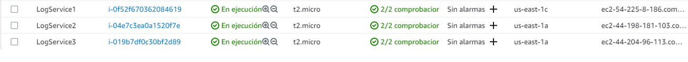
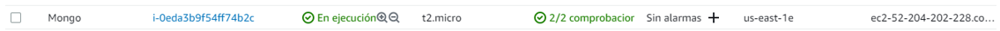
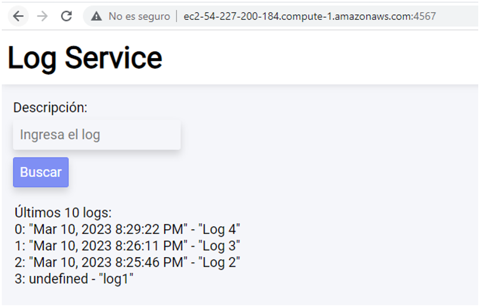

# **TALLER DE DE MODULARIZACIÓN CON VIRTUALIZACIÓN**

Aplicación desplegada en AWS usando una instancia EC2 y Docker para virtualizar. Permite registrar y obtener logs en un navegador web mediante 3 API REST de logs, 1 servidor de base de datos (**MongoDB**) y 1 web el cual implementa un algoritmo de balanceo de carga RoundRobin. La aplicación cumple con la siguiente arquitectura.


## Getting Started

These instructions will get you a copy of the project up and running on your local machine for development and testing purposes.

### Prerequisites

What things you need to install the software and how to install them
Para hacer uso de la aplicación necesitarás tener instalado el siguiente software
- [JDK](https://www.oracle.com/co/java/technologies/javase/javase8-archive-downloads.html) version 1.8.x
- [Maven](https://maven.apache.org/download.cgi)
- [Git](https://git-scm.com/downloads)


### Installing

Para obtener una copia de la aplicación deberás clonar este repositorio. Ingresa la siguiente instrucción en Git Bash:

```
git clone https://github.com/Andresariz88/AREP-Taller05
```

Luego, ejecuta el siguiente comando para compilar y empaquetar todo el proyecto:

```
mvn package
```


## **Diseño**
### APP-LB-RoundRobin
El servidor web está creado con el microframework web [Spark](https://sparkjava.com/), este tiene un componente asociado al recurso ```"logs"``` el cual maneja las peticiones GET y POST que se le hagan. A su vez, estas peticiones se envían a alguna de las 3 instancias de **LogService** gracias a una conexión HTTP y al algoritmo de balanceo de carga **RoundRobin**, el cual distribuye aleatoriamente las peticiones a cualquiera de ellos.

### LogService
Los servidores de logs también están creados con [Spark](https://sparkjava.com/). Estos capturan las peticiones GET y POST que se hagan y mediante el Driver de MongoDB, crea las peticiones que se harán a la base de datos ya sea para obtener datos o para agregarlos.

### MongoDB
Base de datos no relacional creada a partir de la imagen mongo:3.6.1 de Docker.

## **Virtualización local**
Para virtualizar y probar localmente el proyecto se hizo de la siguiente manera:

1. DockerFile: Se crearon dos archivos DockerFile, uno para **APP-LB-RoundRobin** y otro para **LogService**.

    

    

2. Luego, en el archivo ```docker-compose.yml``` se indicaron los servicios necesarios para la aplicación, cada uno con su respectivo puerto.

    ```
    version: '2'


    services:
    web:
        build:
        context: .
        dockerfile: Dockerfile
        container_name: web
        ports:
        - "4567:6000"
    db:
        image: mongo:3.6.1
        container_name: db
        volumes:
        - mongodb:/data/db
        - mongodb_config:/data/configdb
        ports:
        - 27017:27017
        command: mongod
    log1:
        build:
        context: .
        dockerfile: DockerLogService
        container_name: LogService1
        ports:
        - "35001:6000"
    log2:
        build:
        context: .
        dockerfile: DockerLogService
        container_name: LogService2
        ports:
        - "35002:6000"
    log3:
        build:
        context: .
        dockerfile: DockerLogService
        container_name: LogService3
        ports:
        - "35003:6000"

    volumes:
    mongodb:
    mongodb_config:
    ```

3. Finalmente, se ejecutaron los comandos ```docker-compose build``` y ```docker-compose up -d``` para crear las instancias de los contenedores con las imágenes antes especificadas.

    

    

## **Virtualización AWS**
Para virtualizar y desplegar el proyecto en AWS se hizo de la siguiente manera:

1. Dado que anteriormente ejecutamos el comando ```docker-compose up -d```, las imagenes quedaron creadas localmente. Así que procederemos a pushearlas al repositorio de DockerHub. Primero con ```docker tag SOURCE_IMAGE[:TAG] TARGET_IMAGE[:TAG]``` y luego con ```docker push [OPTIONS] NAME[:TAG]```.

    

    

    

2. Una vez tengamos las imágenes en el repositorio, procederemos a correrlas en la máquina virtual de AWS por medio de ```docker run```.

    

    Y así para cada imagen.

3. Y listo, ya tenemos la aplicación corriendo completamente en la nube y con contenedores.

    


## Built With

* [Dropwizard](http://www.dropwizard.io/1.0.2/docs/) - The web framework used
* [Maven](https://maven.apache.org/) - Dependency Management
* [ROME](https://rometools.github.io/rome/) - Used to generate RSS Feeds

## Authors

* **Andrés Ariza** - *Initial work* - [Andresariz88](https://github.com/Andresariz88)


