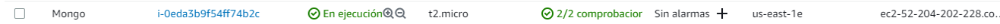
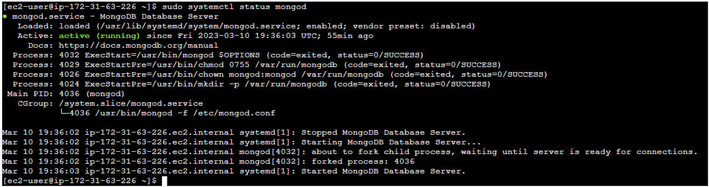
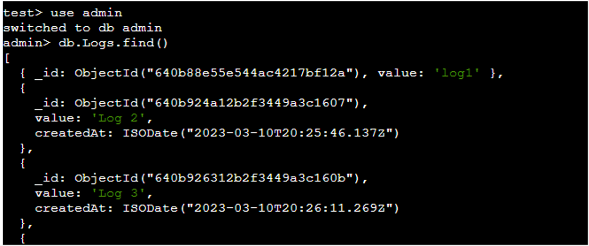

# **TALLER DE DE MODULARIZACIÓN CON VIRTUALIZACIÓN**

Aplicación desplegada en AWS usando varias instancias EC2. Permite registrar y obtener logs en un navegador web mediante 3 API REST de logs, 1 servidor de base de datos (**MongoDB**) y 1 web el cual implementa un algoritmo de balanceo de carga RoundRobin. La aplicación cumple con la siguiente arquitectura.


## Getting Started

These instructions will get you a copy of the project up and running on your local machine for development and testing purposes.

### Prerequisites

What things you need to install the software and how to install them
Para hacer uso de la aplicación necesitarás tener instalado el siguiente software
- [JDK](https://docs.aws.amazon.com/es_es/corretto/latest/corretto-8-ug/amazon-linux-install.html) version 1.8.x
- [Maven](https://maven.apache.org/download.cgi)
- [Git](https://git-scm.com/downloads)
- [MongoDB](https://docs.aws.amazon.com/dms/latest/sbs/chap-mongodb2documentdb.02.html)


### Installing

Para obtener una copia de la aplicación deberás clonar este repositorio. Ingresa la siguiente instrucción en Git Bash:

```
git clone https://github.com/Andresariz88/AREP-Taller06
```

Luego, ejecuta el siguiente comando para compilar y empaquetar todo el proyecto:

```
mvn package
```


## **Diseño**
### APP-LB-RoundRobin
El servidor web está creado con el microframework web [Spark](https://sparkjava.com/), este tiene un componente asociado al recurso ```"logs"``` el cual maneja las peticiones GET y POST que se le hagan. A su vez, estas peticiones se envían a alguno de los 3 servidores **LogService** gracias a una conexión HTTP y al algoritmo de balanceo de carga **RoundRobin**, el cual distribuye aleatoriamente las peticiones a cualquiera de ellos.

### LogService
Los servidores de logs también están creados con [Spark](https://sparkjava.com/). Estos capturan las peticiones GET y POST que se hagan y mediante el Driver de MongoDB, crea las peticiones que se harán a la base de datos ya sea para obtener datos o para agregarlos.

### MongoDB
Base de datos no relacional instalada en la máquina EC2.

## **Implementación**
Todas las instacias EC2 deberán tener [JDK](https://docs.aws.amazon.com/es_es/corretto/latest/corretto-8-ug/amazon-linux-install.html) version 1.8.x para Amazon Linux instalado.


### MongoDB
Se instanció la máquina y se instaló [MongoDB](https://docs.aws.amazon.com/dms/latest/sbs/chap-mongodb2documentdb.02.html) en ella.





Se creó la base de datos y se insertaron datos de prueba.



### LogService (1, 2 y 3)
Se instanciaron las 3 máquinas y con ayuda de ```SFTP``` se enviaron las carpetas target de cada uno de los proyectos a cada instancia EC2 correspondiente a cada LogService.


Con ayuda de ```java -cp``` se ejecutó cada programa y se probó que funcionaran las conexiones con la base de datos.


### APP-LB-RoundRobin
Se instanció la máquina y con ayuda de ```SFTP``` se envió la carpeta target correspondiente al programa de la app web RoundRobin.


Con ayuda de ```java -cp``` se ejecutó el programa y se probó que funcionara la conexión con los servidores LogService.


## Built With

* [Dropwizard](http://www.dropwizard.io/1.0.2/docs/) - The web framework used
* [Maven](https://maven.apache.org/) - Dependency Management
* [ROME](https://rometools.github.io/rome/) - Used to generate RSS Feeds

## Authors

* **Andrés Ariza** - *Initial work* - [Andresariz88](https://github.com/Andresariz88)


